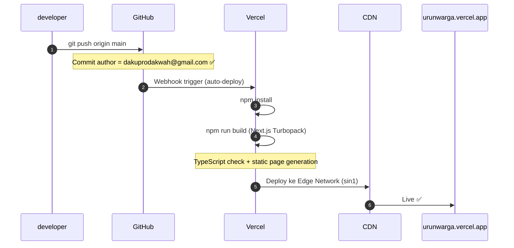

# 60_build_deploy_guide

# **`60_build_deploy_guide.md`**

**Status:** *Operational Reference* | **Audience:** *Developer, AI Coder, Maintainer*

---

## **I. Infrastruktur Deployment**

URUN menggunakan pipeline CI/CD otomatis berbasis GitHub → Vercel. Setiap push ke branch `main` di repositori GitHub akan memicu build Vercel secara otomatis.

| Komponen | Detail |
|----------|--------|
| **Platform** | Vercel (Edge Network, Region: `sin1` Singapore) |
| **Framework** | Next.js 16 (App Router, Turbopack) |
| **Node Version** | 24.x |
| **Build Command** | `npm run build` |
| **Output Directory** | `.next` (dikelola Vercel) |
| **Vercel Project** | `inframeet-s-projects/urunwarga` |
| **Project ID** | `prj_9VvhG7y8cGPBSW9pL9vGyn0lEq4w` |
| **GitHub Repo** | `github.com/zaditprodakwah/urun` |
| **Production Domain** | `urunwarga.vercel.app` |

---

## **II. ⚠️ Aturan Kritis: Git Commit Author**

> **WAJIB DIIKUTI. Pelanggaran menyebabkan deployment Blocked dan produksi tidak terupdate.**

Vercel project `inframeet-s-projects/urunwarga` **hanya menerima build** dari commit yang authornya adalah member tim Vercel yang terdaftar.

### Konfigurasi yang Benar (Authorized ✅)

```bash
git config user.email "dakuprodakwah@gmail.com"
git config user.name  "zaditprodakwah"
```

| Field | Nilai |
|-------|-------|
| Email | `dakuprodakwah@gmail.com` |
| GitHub Username | `zaditprodakwah` |
| Vercel Account | `dakuprodakwah-4228` |
| Status di Tim | ✅ Member `inframeet-s-projects` |

### Konfigurasi yang DILARANG (Blocked ❌)

```bash
# JANGAN gunakan ini — akan menghasilkan status "Blocked" di Vercel
git config user.email "muhzadnet@gmail.com"
git config user.name  "bitmuh"
```

| Field | Nilai |
|-------|-------|
| Email | `muhzadnet@gmail.com` |
| GitHub Username | `bitmuh` |
| Vercel Account | `muhzadit-2318` |
| Status di Tim | ❌ Bukan member `inframeet-s-projects` |

### Cara Verifikasi Sebelum Push

```bash
git config user.email  # harus: dakuprodakwah@gmail.com
git config user.name   # harus: zaditprodakwah
```

---

## **III. Alur Deploy Normal**



**Durasi build normal:** ~10–16 detik (dengan build cache).

---

## **IV. Environment Variables**

Variabel ini wajib dikonfigurasi di **Vercel Project Settings → Environment Variables** (untuk produksi) dan di `.env.local` (untuk development lokal).

| Variable | Scope | Keterangan |
|----------|-------|-----------|
| `NEXT_PUBLIC_SUPABASE_URL` | Public | URL endpoint Supabase |
| `NEXT_PUBLIC_SUPABASE_ANON_KEY` | Public | Kunci publik Supabase (aman di browser) |
| `SUPABASE_SERVICE_ROLE_KEY` | Server-only | Kunci service role (RAHASIA, hanya server) |
| `FONNTE_TOKEN` | Server-only | Token autentikasi WhatsApp Fonnte |
| `FONNTE_WEBHOOK_SECRET` | Server-only | Secret validasi payload webhook Fonnte |

> **Keamanan:** `SUPABASE_SERVICE_ROLE_KEY` dan `FONNTE_TOKEN` tidak boleh pernah ter-expose ke browser. Pastikan prefix `NEXT_PUBLIC_` hanya digunakan untuk variabel yang memang public.

---

## **V. Routes & Build Types**

| Route | Build Type | Revalidasi | Keterangan |
|-------|-----------|-----------|-----------|
| `/` | Static (SSG) | — | Homepage |
| `/catalog` | ISR | 60 detik | Katalog publik |
| `/catalog/[slug]` | SSR | On-demand | Detail produk + JSON-LD |
| `/leaderboard` | SSR | On-demand | Papan keaktifan warga |
| `/multisig` | Client-side | — | Multi-Sig Command Center |
| `/api/webhook/whatsapp` | Dynamic | — | Endpoint webhook Fonnte |
| `/api/multisig/*` | Dynamic | — | API Multi-Sig backend |
| `/api/parser` | Dynamic | — | Ethical marketplace parser |
| `/api/reconcile` | Dynamic | — | Engine rekonsiliasi kas |

---

## **VI. Troubleshooting Deployment**

### Masalah: Deployment status "Blocked"

**Penyebab:** Commit author bukan member tim Vercel `inframeet-s-projects`.

**Solusi:**
```bash
# 1. Set author yang benar
git config user.email "dakuprodakwah@gmail.com"
git config user.name  "zaditprodakwah"

# 2. Buat empty commit baru sebagai trigger
git commit --allow-empty -m "chore: retrigger Vercel build"

# 3. Push
git push origin main
```

### Masalah: Production URL 404 NOT_FOUND

**Penyebab umum:**
1. Deployment terbaru masih "Blocked" (author salah) → lihat solusi di atas
2. Domain `urunwarga.vercel.app` tidak terpasang ke project → cek di Vercel Dashboard → Settings → Domains
3. Routes baru belum di-commit/push

**Cara cek status deployment:**
```bash
npx vercel list
```

### Masalah: Build gagal (TypeScript error)

**Solusi:** Jalankan build lokal terlebih dahulu sebelum push:
```bash
npm run build
```
Pastikan tidak ada error sebelum push ke `main`.

### Masalah: Environment variable tidak terbaca di produksi

**Solusi:**
1. Buka Vercel Dashboard → `inframeet-s-projects/urunwarga` → Settings → Environment Variables
2. Pastikan semua variabel dari `.env.local` sudah ditambahkan
3. Redeploy: `npx vercel --prod --yes`

---

## **VII. Deploy Manual via Vercel CLI**

Jika diperlukan deploy manual (bypass GitHub):

```bash
# Pastikan terautentikasi sebagai akun yang benar
npx vercel whoami  # harus: muhzadit-2318 atau scope devapenseo

# Deploy ke production
npx vercel --prod --yes
```

> **Catatan:** Deploy via CLI menggunakan scope `devapenseo` (bukan `inframeet-s-projects`), sehingga hasilnya di URL `urunwarga-xxx-devapenseo.vercel.app` — berbeda dari domain utama `urunwarga.vercel.app` yang terhubung ke project `inframeet-s-projects`. Untuk update domain utama, selalu gunakan push ke GitHub.

---

## **VIII. Checklist Sebelum Push ke Production**

```
[ ] git config user.email = dakuprodakwah@gmail.com
[ ] git config user.name  = zaditprodakwah
[ ] npm run build → tidak ada error
[ ] Semua environment variable sudah di-set di Vercel
[ ] .env.local tidak ter-commit (ada di .gitignore)
[ ] Branch aktif adalah `main`
```
