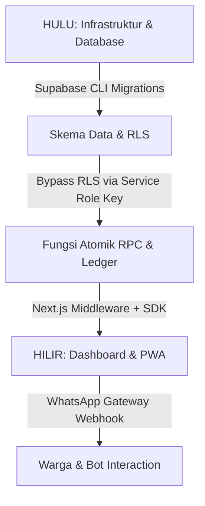
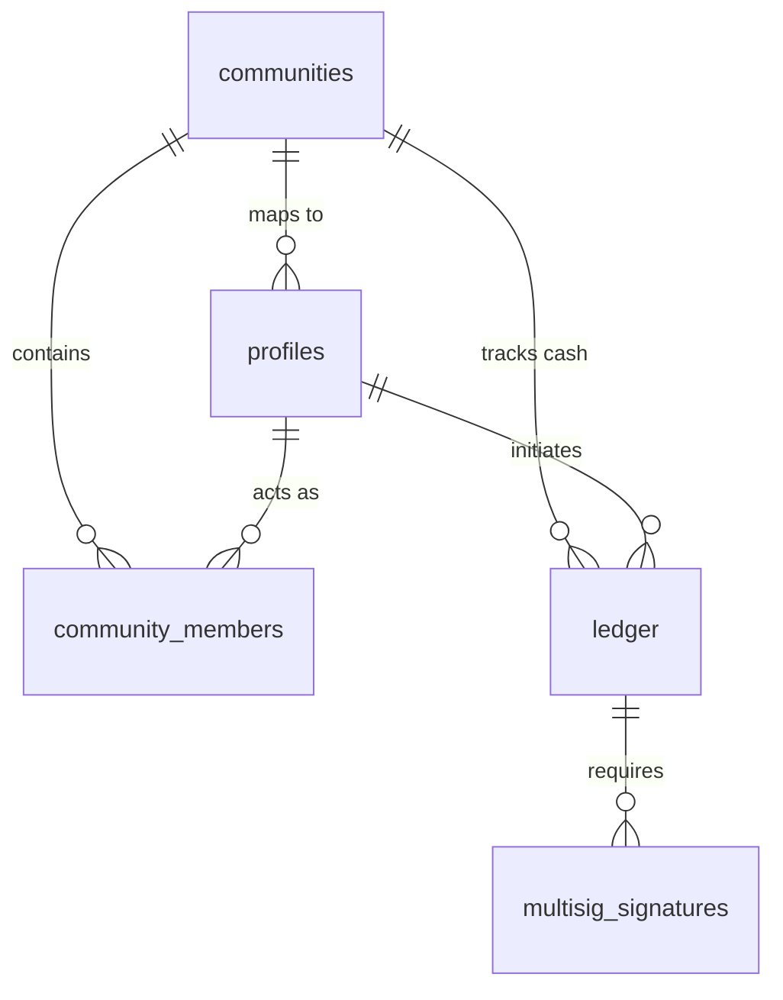

# URUN Developer & DevOps Manual (Layer 1: System Tier)

**Kode Dokumen:** DOC-URUN-SYS-01  
**Status:** *Master Technical Guide* | **Target Pembaca:** *Founder, Lead Architect, DevOps, Backend Developers*  
**Versi:** 1.0.0 | **Tanggal Diperbarui:** 2026-05-22  

---

## 🧭 1. Peta Navigasi Hulu-ke-Hilir

Manual ini memandu pengembang dari **Hulu (Infrastruktur, Database Relasional, Migrasi)** hingga ke **Hilir (API Integrasi, PWA, dan Mekanisme Deployment)**. Kontrol akses Layer 1 adalah lapisan paling krusial di mana **`SUPABASE_SERVICE_ROLE_KEY`** digunakan untuk melewati (*bypass*) seluruh kebijakan keamanan Row Level Security (RLS) guna melakukan operasi sistem murni.



---

## 🛠️ 2. Arsitektur & Tumpukan Teknologi (Tech Stack)

Sistem URUN dibangun menggunakan tumpukan teknologi modern berkinerja tinggi untuk memastikan skalabilitas komunitas mikro (*micro-community*):

1. **Frontend Framework:** Next.js (App Router) + TypeScript + Tailwind CSS.
2. **PWA Capabilities:** Service Worker untuk integrasi *offline-first* dan instalasi PWA di peranti bergerak warga.
3. **Database & Realtime:** Supabase PostgreSQL + Supabase Realtime (untuk umpan kas langsung).
4. **Keamanan & Otorisasi:** 
   - **Row Level Security (RLS)** ganda di tingkat PostgreSQL.
   - **Next.js Middleware** untuk pemisahan visual dan rute URL di tingkat *client/server-side*.
5. **Gateway Eksternal:** Integrasi *WhatsApp Gateway API* untuk memicu mutasi ledger dari pesan obrolan warga (simulasi interaktif disertakan pada lingkungan demo).

---

## 🗄️ 3. Arsitektur Relasional & Skema Data

Sistem URUN dirancang sebagai database **Multi-Tenant Siloed** di mana pemisahan fisik antarkomunitas (`community_id`) diisolasi secara mutlak di tingkat database.

### A. Tabel Utama (Core Tables)

Berikut adalah ringkasan skema tabel relasional utama sesuai dengan *Master Database Specification*:

* **`communities`**: Tabel induk penyimpan batasan wilayah administratif (RT/RW/Desa) beserta koordinat geografis (`geo_context`) dan konfigurasi dinamis (`settings` seperti ambang batas Multi-Sig).
* **`profiles`**: Profil global pengguna. Menyimpan kolom kritis `global_role` yang membagi pengguna ke dalam **Layer 1 (Founder/System)**, **Layer 2 (Investor)**, **Layer 3 (Auditor)**, dan **Layer 5 (User)**.
* **`community_members`**: Tabel relasi lokal antara profil dengan komunitas tertentu. Menyimpan `role` lokal (**Layer 4: admin/pengurus** atau **Layer 5: warga**).
* **`ledger`**: Buku besar keuangan transaksi komunitas yang bersifat **Append-Only**. Data tidak boleh di-`UPDATE` atau di-`DELETE`. Koreksi kesalahan harus dicatat sebagai entri pembalik (*reversal*) dengan `direction = 'out'` atau `'in'`.
* **`workflow_processes`**: Mengelola status daur hidup pengadaan tender lokal (misal: `requested` ➡️ `procuring` ➡️ `completed`).
* **`multisig_signatures`**: Menyimpan bukti persetujuan digital dari pengurus komunitas sebelum transaksi ledger di atas batas nominal disetujui secara permanen.

### B. Diagram Relasi Entitas (Entity-Relationship Diagram)



---

## 🔒 4. Kebijakan Keamanan & RLS (Row Level Security)

Keamanan URUN mengadopsi prinsip **Zero Trust** pada level database.

### A. Konfigurasi Row Level Security (RLS)

Seluruh tabel sensitif seperti `ledger` dan `profiles` dilengkapi dengan aturan RLS aktif. Pengguna umum hanya dapat melihat data yang berada di lingkup `community_id` milik mereka.

* **Warga (Layer 5):** Hanya diizinkan membaca baris ledger komunitas mereka sendiri dan data profil pribadinya.
* **Pengurus (Layer 4):** Diizinkan menulis entri ledger bertipe kontribusi atau pengeluaran, tetapi terbatas pada komunitas yang dikelolanya.
* **Auditor (Layer 3):** Diizinkan melihat rangkuman agregat regional dengan identitas yang disamarkan (*anonymized*).
* **Investor (Layer 2):** Hanya memiliki akses *Read-Only* ke tampilan analitik yang telah diagregasi (`public.view_investor_analytics`).
* **Founder / DevOps (Layer 1):** Menggunakan `SUPABASE_SERVICE_ROLE_KEY` dari sisi server-side / CLI. Kunci ini secara otomatis **membypass seluruh kebijakan RLS**.

> [!CAUTION]
> Jangan pernah memaparkan `SUPABASE_SERVICE_ROLE_KEY` ke sisi frontend aplikasi (*client-side*). Keberadaannya di frontend akan merusak seluruh model keamanan multi-tenant URUN secara instan.

### B. Implementasi Segregasi Peran pada Middleware

Pemisahan akses diatur secara ketat di sisi server-side pada berkas [src/middleware.ts](file:///Users/mac/Downloads/URUN/src/middleware.ts):

```typescript
// Pengecekan Kredensial Global Role pada Rute Terproteksi
const globalRole = request.cookies.get('urun_global_role')?.value || 'user';

if (isAdminRoute && !['investor', 'founder', 'system'].includes(globalRole)) {
  return NextResponse.redirect(new URL('/', request.url));
}

if (isComplianceRoute && !['auditor', 'founder', 'system'].includes(globalRole)) {
  return NextResponse.redirect(new URL('/', request.url));
}
```

---

## 🚀 5. DevOps: Panduan Instalasi, Migrasi, & Seeding

### A. Variabel Lingkungan (`.env.local`)

Buat berkas `.env.local` di direktori utama proyek dengan konfigurasi sebagai berikut:

```env
# Supabase Public Keys (Aman untuk Frontend)
NEXT_PUBLIC_SUPABASE_URL=https://your-project-id.supabase.co
NEXT_PUBLIC_SUPABASE_ANON_KEY=eyJhbGciOiJIUzI1NiIsInR5cCI6IkpXVCJ9...

# Supabase Private Keys (HANYA UNTUK SERVER-SIDE / LAYER 1)
SUPABASE_SERVICE_ROLE_KEY=eyJhbGciOiJIUzI1NiIsInR5cCI6IkpXVCJ9...

# WhatsApp Bot Integration API (Simulasi)
WHATSAPP_API_TOKEN=wa_sim_token_xyz123
WHATSAPP_WEBHOOK_SECRET=wh_sec_abc456
```

### B. Prosedur Inisialisasi Database via Supabase CLI

Pastikan Anda telah memasang Supabase CLI di peranti Anda.

1. **Inisialisasi Proyek:**
   ```bash
   supabase init
   ```
2. **Menjalankan Migrasi Lokal:**
   Gunakan perintah berikut untuk menerapkan seluruh skema database URUN dari awal secara berurutan:
   ```bash
   supabase db start
   ```
3. **Membuat Migrasi Baru:**
   ```bash
   supabase migration new nama_migrasi_baru
   ```
4. **Menerapkan Migrasi ke Server Produksi:**
   ```bash
   supabase db push
   ```

### C. Seeding Akun Demo (`seed_demo_accounts.sql`)

Untuk tujuan demonstrasi tanpa membutuhkan OTP/SMS asli, sistem URUN dilengkapi skrip seeding otomatis di berkas [supabase/seed_demo_accounts.sql](file:///Users/mac/Downloads/URUN/supabase/seed_demo_accounts.sql). Skrip ini menyuntikkan lima akun dengan kredensial bypass berikut:

| Peran Sistem | Email Kredensial | WhatsApp Bypass | Otoritas Global |
|--------------|------------------|-----------------|-----------------|
| **Layer 1 (Founder)** | `founder@urun.demo` | - | `founder` |
| **Layer 2 (Investor)**| `investor@urun.demo`| - | `investor` |
| **Layer 3 (Auditor)** | `auditor@urun.demo` | - | `auditor` |
| **Layer 4 (Pengurus)**| `rt@urun.demo`      | - | `user` (Lokal: `pengurus`) |
| **Layer 5 (Warga)**   | -                | `081111111111`  | `user` (Lokal: `warga`) |

Jalankan perintah ini di CLI untuk mengisi basis data demo Anda:
```bash
supabase db reset
```
*(Perintah di atas akan menghapus database lokal dan menerapkan ulang seluruh migrasi beserta berkas `seed` otomatis).*

---

## 📡 6. Protokol Integrasi & Sinkronisasi Keuangan

### A. Arsitektur WhatsApp Bot Gateway Webhook

Interaksi hilir warga dilakukan melalui WhatsApp. Webhook dikonfigurasi untuk menerima pesan bertipe teks dari gateway WhatsApp eksternal:

```
[Citizen WhatsApp Phone] ➡️ [WhatsApp Gateway Partner] ➡️ [POST /api/webhook/whatsapp]
```

Endpoint `/api/webhook/whatsapp` memverifikasi token pengirim, lalu mencocokkan nomor telepon warga dengan data di tabel `profiles.phone`. Jika valid, perintah teks seperti **"BAYAR IURAN RT01"** akan memicu RPC fungsi database `process_collective_contribution` dengan kunci idempotensi unik (`idempotency_key`) guna menghindari duplikasi transaksi jika pengiriman ulang jaringan terjadi.

### B. Integritas Ledger dengan Penjagaan Rekonsiliasi Hash

Setiap mutasi kas baru didaftarkan di tabel `ledger`. Untuk membuktikan bahwa data historis tidak dirusak oleh oknum pengurus atau basis data yang disusupi, sistem menghitung hash kriptografi berantai (seperti Blockchain terdistribusi):

$$\text{Current Hash} = \text{SHA-256}(\text{Previous Hash} \parallel \text{Amount} \parallel \text{Actor ID} \parallel \text{Timestamp})$$

Proses kalkulasi ini dijalankan secara otomatis via PostgreSQL Triggers yang berada di [20260521000005_triggers_and_functions.sql](file:///Users/mac/Downloads/URUN/supabase/migrations/20260521000005_triggers_and_functions.sql) untuk menjaga integritas absolut dari hulu.

---

## 🚀 7. Panduan Deployment (Vercel & Supabase)

### A. Langkah Demi Langkah Deployment

1. **Deploy Supabase:**
   - Buat proyek baru di [Supabase Dashboard](https://supabase.com).
   - Terapkan seluruh migrasi dengan menyalin berkas-berkas migrasi lokal ke editor SQL Supabase atau jalankan `supabase db push`.
   - Jalankan script seeding untuk akun demo di Editor SQL Supabase.

2. **Deploy Next.js ke Vercel:**
   - Hubungkan repositori GitHub Anda ke [Vercel](https://vercel.com).
   - Masukkan seluruh variabel lingkungan (`.env.local`) di pengaturan proyek Vercel.
   - Atur Framework Preset ke **Next.js**.
   - Klik **Deploy**.

3. **Verifikasi Jalur Integrasi:**
   - Akses halaman login PWA.
   - Pastikan PWA dapat terinstal di peranti seluler (*Add to Home Screen*).
   - Uji coba login menggunakan domain demo `@urun.demo` untuk memastikan bypass berjalan lancar di server produksi.

---

## 🔗 8. Integrasi Pihak Ketiga & API Developer

Sistem URUN dirancang dengan arsitektur *"Sovereign Interoperability"*, yang berarti sistem menyediakan sederet API RESTful dan Webhook yang **bisa digunakan, ditawarkan, atau dijual sebagai model bisnis B2B (Business-to-Business)** kepada pihak ketiga. Integrasi ini mendasarkan standar keamanan pada otentikasi JWT (Scope-Based Access Control) dan validasi HMAC-SHA256 untuk memastikan kedaulatan data tetap terjaga.

### A. API Kemitraan Afiliasi Eksternal (Inbound Revenue)
* **Rute API:** `POST /api/v1/affiliate/callback`
* **Fungsi:** Memungkinkan ekosistem luar seperti marketplace (misal: Tokopedia, Shopee) atau vendor eksternal untuk mengirimkan data komisi afiliasi.
* **Nilai Bisnis:** Secara otomatis membagi persentase pendapatan afiliasi (misal: 70% masuk secara atomik ke kas RT, 30% menjadi keuntungan platform URUN). Sangat potensial untuk monetisasi B2B.

### B. API Katalog Publik (SEO & Market Integration)
* **Rute API:** `GET /v1/catalog` dan `GET /v1/catalog/{slug}`
* **Fungsi:** Menyediakan data katalog barang/jasa untuk mesin pencari atau *developer* aplikasi pihak ketiga (dilengkapi JSON-LD Schema).
* **Nilai Bisnis:** Aplikasi marketplace lokal tingkat kecamatan dapat menarik (*pull*) data katalog RT secara langsung untuk pemasaran komunal.

### C. API Transaksi Ledger
* **Rute API:** `POST /v1/ledger/contribution`
* **Fungsi:** Memungkinkan vendor (seperti toko ritel PPOB) untuk memotong saldo atau menambahkan kas secara terprogram.
* **Keamanan:** Dilindungi penuh oleh kewajiban penyertaan `idempotency_key` di *headers* untuk menghindari risiko transaksi ganda.

### D. Webhook Event Stream
* **Rute API:** `POST /v1/webhook/events`
* **Fungsi:** Push notifikasi seketika kepada *developer* luar saat terjadi pergerakan kas atau perubahan status tender.
* **Nilai Bisnis:** Pihak ketiga dapat mendaftarkan bot Discord, bot Telegram, atau integrasi webhook khusus RT mereka.

---

*Dokumen panduan ini dirancang untuk pemeliharaan berkelanjutan. Jika terjadi perubahan skema DDL di tingkat hulu, wajib memperbarui modul dokumentasi teknis ini agar sinkronisasi antartim tetap terjaga.*
