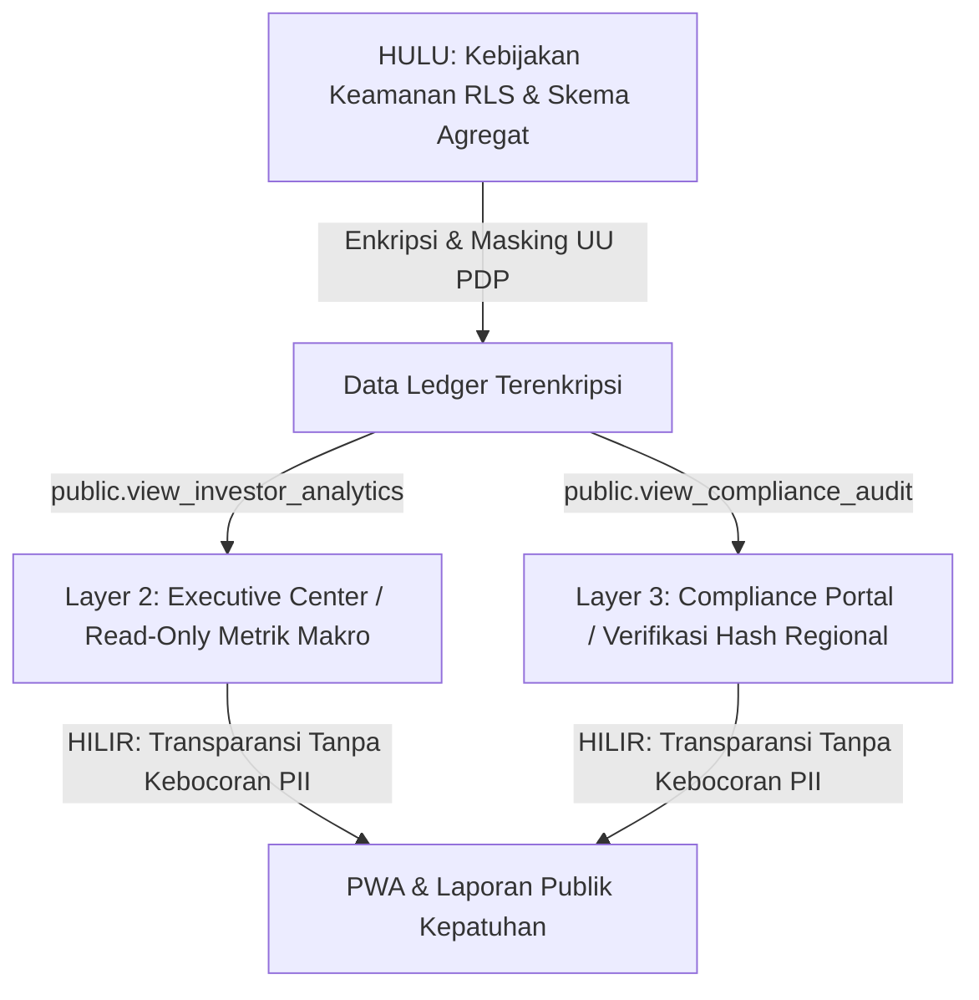

# URUN Strategic & Compliance Executive Report (Layer 2 & 3: Strategy & Oversight Tiers)

**Kode Dokumen:** DOC-URUN-STR-02  
**Status:** *Corporate Governance & Compliance Standard* | **Target Pembaca:** *Investor, Eksekutif, Dewan Pengawas, Auditor Internal/Eksternal, Pemerintah*  
**Versi:** 1.0.0 | **Tanggal Diperbarui:** 2026-05-22  

---

## 🧭 1. Peta Tata Kelola Hulu-ke-Hilir

Laporan ini ditujukan bagi para pemangku kepentingan strategis dan pengawas kepatuhan. URUN menerapkan prinsip **"Compliance by Design"**—memadukan pengawasan makro untuk investor dengan audit terenkripsi bagi regulator, sambil secara mutlak melindungi privasi data warga sesuai dengan regulasi nasional.



---

## 🏛️ 2. Filosofi Segregasi Tugas (Segregation of Duties)

Dalam tata kelola sistem URUN, segregasi tugas (SoD) diatur secara kaku untuk mencegah benturan kepentingan (*conflict of interest*) dan penyalahgunaan kekuasaan data:

1. **Pemisahan Otoritas Operasional vs Strategis:** Investor (Layer 2) dan Auditor (Layer 3) adalah pengamat eksternal (*observers*). Mereka **tidak memiliki hak operasional** untuk membuat komunitas, menambah saldo kas, mengubah tender, atau mengotentikasi mutasi keuangan.
2. **Pemisahan Otoritas Wilayah (Multi-Tenancy):** Auditor lokal hanya dapat memeriksa data komunitas dalam yurisdiksi administratif mereka (misalnya, di tingkat Kecamatan atau Kelurahan tertentu) tanpa mampu melihat ledger komunitas di luar batas tugasnya.
3. **Prinsip Least Privilege:** Akses ke *Raw Data* warga (nama asli, NIK, nomor telepon) ditutup secara mutlak untuk Layer 2 & 3. Sistem menyaring data tersebut langsung dari tingkat basis data sebelum dikirimkan ke dasbor.

---

## 📈 3. Layer 2: Strategy Tier (Investor / Eksekutif)

### A. Peran & Akses Data Makro
Investor dan eksekutif memerlukan pandangan mata burung (*bird's-eye view*) terhadap kesehatan ekosistem URUN guna memantau pertumbuhan modal dan dampak sosial gotong royong (*social impact ROI*).

* **Titik Masuk Rute UI:** `/admin/exec-center` (Executive Center).
* **Kredensial Keamanan:** `profiles.global_role = 'investor'`.
* **Sumber Data Database:** Dialirkan melalui view khusus `public.view_investor_analytics`. Aturan RLS memblokir kueri langsung ke tabel transaksi individu `public.ledger`.

### B. Metrik Makro yang Disajikan
Dasbor Executive Center menyajikan data agregat berikut secara real-time:
* **Total Komunitas Aktif (Onboarded Communities):** Pertumbuhan bulanan jumlah RT/RW yang mengadopsi PWA URUN.
* **Volume Transaksi Kas (GMV / Transaction Velocity):** Akumulasi perputaran kas warga se-nasional/regional untuk menganalisis fluiditas ekonomi lokal.
* **Tingkat Partisipasi Gotong Royong:** Persentase rata-rata warga yang berkontribusi aktif dalam tender lokal.

### C. Pembatasan Mutlak (Write/Delete Ban)
Secara arsitektural, UI pada rute `/admin/exec-center` tidak memuat komponen *input*, *button modify*, atau tombol hapus data. Middleware Next.js dan kebijakan RLS Postgres akan langsung menolak jika ada upaya menyisipkan data mutasi kas secara ilegal.

---

## 🕵️‍♂️ 4. Layer 3: Oversight Tier (Auditor / Pemerintah)

### A. Peran & Akses Kepatuhan Audit
Pemerintah daerah atau auditor internal bertugas memastikan tidak ada penyelewengan dana warga, pencucian uang, atau manipulasi laporan kas oleh pengurus RT/RW lokal.

* **Titik Masuk Rute UI:** `/compliance` (Compliance & Audit Center).
* **Kredensial Keamanan:** `profiles.global_role = 'auditor'`.
* **Sumber Data Database:** Kueri diarahkan ke view granular `public.view_compliance_audit`.

### B. Isolasi Regional Administratif
Auditor tidak dapat melakukan audit se-nasional secara acak. Hak akses mereka diikat pada koordinat regional di tabel `communities.geo_context` (misal: Provinsi: DKI Jakarta, Kota: Jakarta Timur). Auditor hanya dapat melihat transaksi yang terdaftar di komunitas dalam koordinat wilayah tersebut.

### C. Pembuktian Rekonsiliasi Hash Kriptografi
Untuk menjamin akuntabilitas, sistem URUN menerapkan teknologi ledger append-only berantai (*chained ledger*). Auditor dapat menekan tombol **"Verifikasi Rekonsiliasi Kas"** di portal `/compliance`.
Sistem akan mengeksekusi pemeriksaan matematis:
1. Membaca baris ledger secara berurutan.
2. Membaca `cryptographic_hash` pada baris tersebut.
3. Mencocokkannya kembali dengan kalkulasi ulang SHA-256 dari baris sebelumnya.
4. Jika hash tidak cocok, sistem akan menandai transaksi tersebut dengan bendera merah 🚩 sebagai indikasi **manipulasi database retrospektif**.

---

## 🔒 5. Pelindungan Data Pribadi (UU PDP) & Data Masking

URUN berkomitmen penuh terhadap Undang-Undang Pelindungan Data Pribadi (UU PDP). Privasi warga adalah hak kedaulatan mutlak.

### A. Kebijakan "Warga_Anonim"
Bagi investor (Layer 2) dan auditor (Layer 3), identitas personal warga (Personally Identifiable Information - PII) disamarkan secara mutlak.
* **Nama Lengkap:** Semua nama warga diubah oleh basis data menjadi `Warga_Anonim_#####` (menggunakan bagian akhir hash ID mereka).
* **Nomor Telepon:** Disamarkan (misalnya: `0811****1111`).
* **NIK / Identitas Kependudukan:** Dihash secara kriptografi menggunakan salt dinamis, sehingga tidak dapat diterjemahkan kembali ke bentuk aslinya (*non-reversible*).

```
[Nama Asli: Budi Santoso] ➡️ [Algoritma Masking Postgres] ➡️ [Tampilan UI: Warga_Anonim_9b8c2]
```

### B. Pencegahan Kebocoran Data (Data Leak Prevention)
Seluruh API Endpoint di rute `/api/admin/*` dan `/api/compliance/*` menerapkan proteksi filtering *payload*. Payload JSON yang dikirimkan dari server ke peramban dipastikan tidak mengandung field `phone`, `contact_info`, atau data mentah identitas lainnya.

---

## 🛡️ 6. Jaminan Anti-Fraud & Desentralisasi Kas Komunitas

Sistem keuangan URUN didesain anti-manipulasi dari hulu dengan pilar pertahanan berikut:

### A. Desentralisasi Kas & Proof-of-Reserve
URUN tidak bertindak sebagai bank terpusat yang memegang dana warga secara kolektif di satu rekening tunggal milik platform. Saldo kas diisolasi secara hukum di tingkat masing-masing rekening kas resmi komunitas (desentralisasi tenant). Dasbor menyajikan transparansi saldo nyata (*Proof-of-Reserve*) yang dapat dicocokkan langsung dengan laporan mutasi bank komunitas.

### B. Sistem Otorisasi Multi-Sig (Multi-Signature)
Setiap pengeluaran kas di atas ambang batas nominal tertentu wajib disetujui oleh minimal dua orang pengurus yang berwenang (misalnya: Ketua RT dan Bendahara) sebelum dianggap sah oleh ledger.

1. **Konfigurasi Ambang Batas (Threshold):** Secara default disetel pada **Rp5.000.000** (mengikuti aturan internal basis data). Namun, nilai ini dapat dikonfigurasi secara dinamis per komunitas di kolom `communities.settings->>'multisig_threshold'`.
2. **Alur Kerja Multi-Sig:**
   - Pengurus A mengajukan pengeluaran belanja sebesar Rp6.000.000.
   - Status Ledger disetel ke `pending` (tidak memotong saldo aktif).
   - Pengurus B menerima notifikasi di dasbor `/multisig` atau via WhatsApp Bot.
   - Pengurus B menandatangani transaksi tersebut secara digital (menyimpan baris baru di tabel `multisig_signatures`).
   - Setelah tanda tangan tercukupi, status berubah menjadi `approved` dan saldo kas terpotong secara otomatis.

---

*Laporan tata kelola ini membuktikan bahwa URUN dirancang di atas pondasi akuntabilitas tingkat tinggi, menjadikannya pilihan sistem operasi mikro-komunitas yang aman, patuh hukum, dan tepercaya.*
