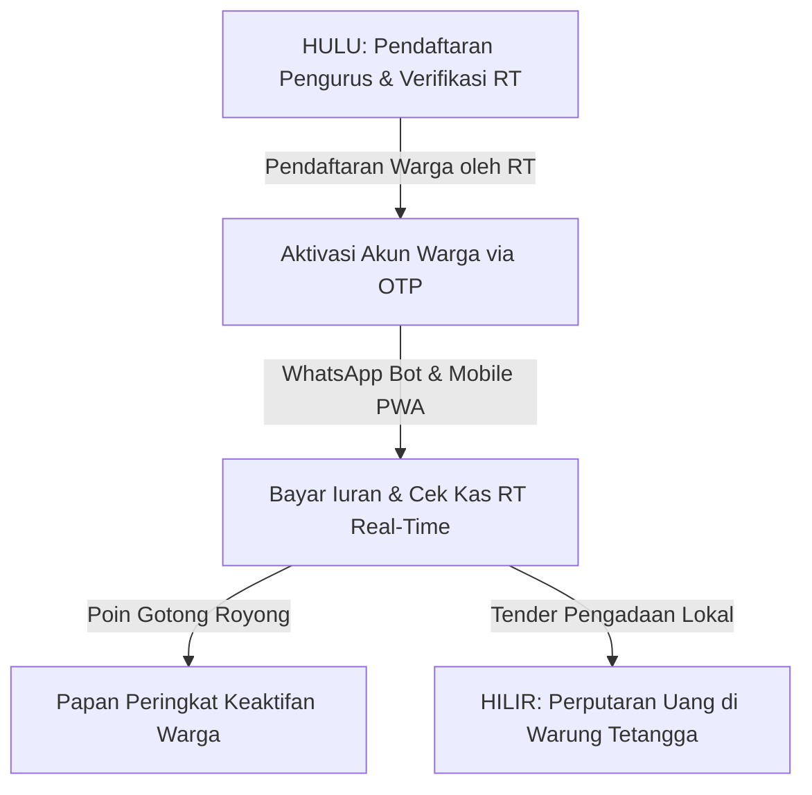

# Buku Saku Warga, Pengurus RT/RW, & Kemitraan URUN (Layer 4, 5, & Publik)

**Kode Dokumen:** DOC-URUN-USR-03  
**Status:** *Community & Citizen Operations Guide* | **Target Pembaca:** *Pengurus RT/RW, Bendahara, Warga Komunitas, Tenan Lokal, Publik*  
**Versi:** 1.0.0 | **Tanggal Diperbarui:** 2026-05-22  

---

## 🧭 1. Peta Kebersamaan Hulu-ke-Hilir

Buku saku ini ditulis khusus untuk Anda—warga, pengurus, bendahara, dan pelaku usaha lokal yang menjadi urat nadi dari kemajuan rukun tetangga kita. URUN mengubah kerumitan administrasi pembukuan menjadi sistem yang transparan, aman, dan penuh kehangatan gotong royong.



---

## 🏡 2. Panduan Operasional Pengurus RT/RW (Layer 4: Local Operational Tier)

Sebagai Pengurus RT/RW (seperti **Ibu Aminah**), Anda memegang amanah kepercayaan warga. URUN menyediakan dasbor khusus untuk mempermudah pekerjaan sosial Anda tanpa perlu pusing mencatat manual di buku kas fisik.

### A. Mengenal Dasbor Komunitas (`/communities/[id]/dashboard`)
Setelah masuk (login) menggunakan email resmi RT Anda, Anda akan disambut oleh Dasbor Komunitas. Di sini Anda bisa:
* **Melihat Saldo Kas RT Aktif:** Angka kas rukun tetangga yang selalu diperbarui secara otomatis setiap kali iuran warga masuk.
* **Memantau Daftar Pembayaran Warga:** Siapa saja tetangga kita yang sudah membayar iuran bulan ini, dan siapa yang belum sempat bayar.
* **Mengajukan Tender Pembangunan:** Misalnya memperbaiki saluran air tersumbat atau mengganti lampu jalan yang mati.

### B. Otorisasi Keuangan Multi-Sig (Multi-Signature)
Untuk mencegah fitnah dan menjaga transparansi keuangan warga, setiap pengeluaran kas yang besar (secara default di atas **Rp5.000.000**, namun dapat disesuaikan di menu pengaturan komunitas) wajib melalui persetujuan digital ganda (*Multi-Sig*):
1. **Pengajuan:** Bendahara atau Ketua RT membuat draf pengeluaran kas untuk pembangunan fisik di dasbor.
2. **Persetujuan:** Pengurus RT lainnya (minimal 2 tanda tangan dari pengurus yang sah) harus mengklik tombol **"Setujui Pengeluaran"** di halaman `/multisig` atau membalas notifikasi WhatsApp Bot pengurus.
3. **Pencatatan:** Saldo kas nyata tidak akan berkurang sebelum persetujuan digital tersebut terpenuhi lengkap.

---

## 💬 3. Panduan Aktivitas Warga & Pelaku Usaha (Layer 5: User Tier)

Bagi warga (seperti **Mas Rio**) dan pelaku usaha setempat (seperti **Pak Budi**), URUN hadir dalam genggaman handphone Anda melalui aplikasi seluler ringan (PWA) dan obrolan WhatsApp sehari-hari.

### A. Memasang Aplikasi PWA di HP Anda
Aplikasi URUN didesain sangat hemat kuota dan memori:
1. Buka situs resmi URUN di peramban (browser) HP Anda.
2. Klik tombol **"Tambahkan ke Layar Utama"** (*Add to Home Screen*) atau ikon instalasi di pojok kanan atas peramban.
3. Aplikasi URUN kini tampil seperti aplikasi biasa di HP Anda, dapat diakses instan, bahkan tetap bisa dibuka saat jaringan internet Anda sedang tidak stabil (*offline-first*).

### B. Kemudahan WhatsApp Bot URUN
Anda tidak perlu membuka aplikasi web jika sedang sibuk. Cukup kirim pesan teks sederhana ke nomor resmi WhatsApp Bot RT:
* Kirim **"KAS"** ➡️ Bot akan membalas dengan info saldo kas RT Anda saat ini secara real-time.
* Kirim **"BAYAR"** ➡️ Bot akan mengirimkan tautan pembayaran iuran instan (QRIS/E-Wallet). Begitu dibayar, kas RT langsung bertambah dan nama Anda muncul di papan transparansi warga.

### C. Poin Gotong Royong (Civic Points) & Leaderboard
Setiap kepedulian Anda dihargai! URUN memiliki halaman [Leaderboard](file:///Users/mac/Downloads/URUN/src/app/leaderboard/page.tsx) (Papan Pahlawan Gotong Royong).
* **Bagaimana cara mendapatkan poin?**
  * Setiap kali Anda membayar iuran tepat waktu ➡️ **+10 Poin**.
  * Setiap kali Anda menyebarkan rujukan tender semen lokal ke tetangga dan transaksi berhasil ➡️ **+2 Poin**.
* Poin ini dikumpulkan untuk membangun reputasi sosial warga yang aktif memajukan rukun tetangganya.

### D. Tender Lokal (Tender Pengadaan)
Uang kas dari warga, kembali ke warung warga! Jika RT membutuhkan bahan bangunan (semen, pasir, cat) untuk gotong royong:
* Pengurus akan membuka **Tender Lokal** di aplikasi.
* Pelaku usaha di lingkungan kita (seperti Pak Budi) dapat mengajukan penawaran harga secara adil.
* Uang belanja kas RT tidak lari ke supermarket besar, melainkan berputar menghidupi warung kelontong milik tetangga kita sendiri.

---

## 🚪 4. Pendaftaran, Onboarding, & Kebijakan Keanggotaan (Public Tier)

Bagaimana sistem memastikan tidak ada penyusupan data atau warga fiktif? URUN menerapkan alur masuk yang sangat aman dan terstruktur.

### A. Pendaftaran Komunitas Baru (Manual Intake)
Rukun Tetangga (RT) baru tidak bisa mendaftar secara otomatis tanpa verifikasi untuk menghindari duplikasi wilayah.
1. Calon Pengurus menghubungi tim URUN melalui halaman **/kontak** (tertaut sebagai "Daftar Pengurus Baru" di footer).
2. Tim Founder (Layer 1) akan memverifikasi legalitas administratif kepengurusan RT Anda.
3. Setelah terverifikasi, tim pengembang akan membuatkan *instance* komunitas dan memberikan akun email login resmi pertama kepada Ketua RT.

### B. Cara Pendaftaran Warga Baru
Warga **TIDAK BISA mendaftarkan diri secara mandiri** dari luar aplikasi demi keamanan data wilayah.
1. Pengurus RT mendaftarkan nomor WhatsApp dan Nama Lengkap warga melalui Dasbor Pengurus RT.
2. Warga yang bersangkutan kini telah terdaftar secara sah di tabel `community_members`.
3. Warga tersebut sekarang dapat masuk ke aplikasi dengan membuka halaman `/login`, memasukkan nomor WhatsApp, dan memverifikasi diri via OTP rahasia yang dikirimkan.

---

## 🛠️ 5. Simulasi Interaktif & Demo Kas di Beranda Utama

### A. URUN LIVE SIMULATOR
Bagi Anda pengunjung baru yang ingin mencoba keajaiban sistem URUN, kunjungi beranda utama. Di sana terdapat modul **URUN Live Simulator**:
* Anda bisa mengetik perintah di simulasi WhatsApp bot di layar kiri.
* Melihat bagaimana iuran kas dan alur tender lokal bertambah secara real-time di layar kanan.
* Modul simulator ini murni merupakan demo interaktif (data tiruan) agar Anda bisa merasakan kemudahan URUN sebelum mendaftarkan RT Anda secara resmi.

### B. Simulasi Papan Peringkat (Leaderboard)
Pada halaman Papan Peringkat, terdapat tombol **"Simulasikan Rujukan Sukses"**. Tombol ini bertujuan memperagakan bagaimana sistem menghitung poin kontribusi gotong royong secara otomatis di database tiruan ketika warga saling mengajak bertetangga.

---

## 🔄 6. Skenario Gotong Royong Hulu-ke-Hilir (Contoh Nyata)

Bagaimana seluruh teknologi ini bekerja bersama dalam kehidupan sehari-hari bertetangga? Mari simak contoh perjalanan kas rukun tetangga ini:

```
[Langkah 1: Mas Rio Bayar Duit RT]
Mas Rio mengirim "BAYAR" ke WA Bot RT ➡️ Membayar via QRIS Rp50.000 ➡️ Ledger RT bertambah Rp50.000 secara real-time ➡️ Mas Rio mendapatkan +10 Poin Gotong Royong di Papan Peringkat.

[Langkah 2: Perencanaan Perbaikan Jalan]
Jalan RT berlubang. Ibu Aminah (Bendahara) membuat Tender Pengadaan Semen & Pasir dengan pagu anggaran Rp6.000.000 di Dasbor Pengurus.

[Langkah 3: Pengadaan Bahan dari Warung Tetangga]
Pak Budi (pemilik toko bangunan lokal) melihat tender di aplikasi PWA URUN ➡️ Pak Budi mengajukan penawaran semen murah seharga Rp5.800.000 ➡️ Ibu Aminah menyetujui penawaran Pak Budi.

[Langkah 4: Persetujuan Otoritas Ganda]
Karena pengeluaran di atas Rp5.000.000, sistem meminta persetujuan Ketua RT ➡️ Ketua RT mengklik "Setujui" di halaman /multisig HP-nya ➡️ Sistem mentransfer dana kas otomatis ke rekening Pak Budi ➡️ Buku kas Ledger mencatat pengeluaran secara transparan dan permanen.
```

---

*Mari bersama-sama wujudkan rukun tetangga yang modern, mandiri, dan berdaulat secara digital bersama URUN!*
