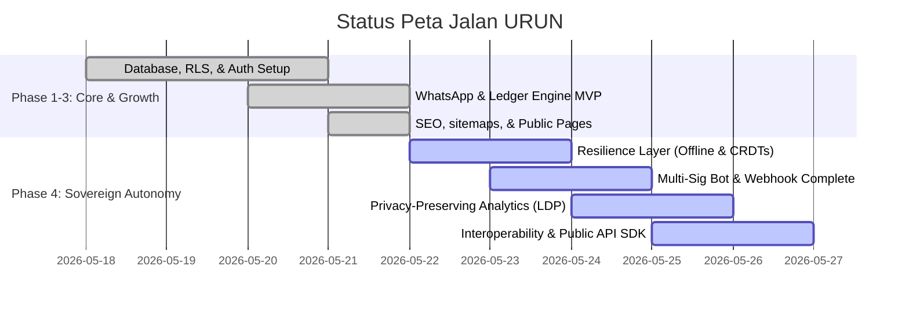

# Rencana Master Eksekusi: Penyelesaian Seluruh Peta Jalan (Roadmap) URUN

Roadmap ini merupakan panduan komprehensif untuk mengubah **URUN** dari sebuah platform yang siap pakai di frontend/backend menjadi **Sistem Operasi Mikro-Komunitas Berdaulat (Sovereign Micro-Community OS)** yang utuh, mandiri, otonom, tahan kegagalan (*offline-resilient*), desentralisasi, dan mendukung interoperabilitas aman pihak ketiga tanpa mengorbankan privasi warga.

---

## 📊 Status Peta Jalan Saat Ini



* **SELESAI (Phases 1, 2, 3 & 6):**
  * **Sovereign Core:** Skema basis data Supabase PostgreSQL dengan Row-Level Security (RLS) kaku per `community_id`.
  * **WhatsApp OTP & Auth:** Sesi otentikasi JWT super ringan ditandatangani `jose` melalui cookie `urun_session` yang divalidasi oleh Middleware `src/proxy.ts` di Edge.
  * **Ledger Engine:** Stored procedure (`process_ledger_entry`) atomik dan bersifat *Append-Only* (Immutable).
  * **UI/UX & Halaman Publik:** Homepage interaktif dengan simulator WhatsApp Webhook, sitemap dinamis, robots.txt, halaman legal lengkap (ToS & Kebijakan Privasi terikat UU PDP No. 27/2022), halaman Tentang (Manifesto), halaman Kontak, 404, 500 error boundary, dan Dynamic OG Image.
  * **Multi-Sig Command Center:** Dashboard Multi-Sig terintegrasi dengan simulasi kuorum persetujuan transaksi pengurus dan audit rekonsiliasi mandiri.

* **BELUM DIIMPLEMENTASIKAN (Phase 4: Sovereign Autonomy):**
  * **Resilience Layer:** Mekanisme *Offline-First* dengan CRDTs (Conflict-free Replicated Data Types) untuk memastikan sistem dapat mencatat kontribusi warga secara lokal saat internet mati, dan menyinkronkannya tanpa konflik ketika koneksi pulih.
  * **Multi-Sig Automation & Bot Trigger:** Menghubungkan mutasi kas bernilai besar di real-world secara otomatis ke Bot WhatsApp Fonnte untuk ditandatangani langsung dari chat warga.
  * **Federated Intelligence:** Analisis tren harga kebutuhan warga yang menjaga privasi menggunakan prinsip *Local Differential Privacy* (LDP) agar transaksi mentah individu tidak bocor ke publik.
  * **Interoperability & Public API SDK:** Menyediakan endpoints API `/v1` yang aman dengan otentikasi token scope-based dan proteksi `Signed Request` menggunakan tanda tangan HMAC-SHA256 untuk vendor/partner eksternal.

---

## 🛠️ Usulan Rencana Implementasi Tahap Akhir (Phase 4)

### 📦 Komponen 1: Resilience Layer (Offline-First & CRDTs Sync Engine)

Agar sistem tetap berdaulat meskipun infrastruktur jaringan terputus (mati lampu, gangguan internet desa), warga dan bendahara harus tetap bisa menginput kontribusi kas secara offline.

#### [NEW] `src/lib/sync/sync_engine.ts`
Implementasi mesin sinkronisasi kustom berbasis Delta-State Replication di LocalStorage:
* Menyimpan entri transaksi lokal ke dalam antrean offline LocalStorage saat `navigator.onLine === false`.
* Menggunakan algoritma LWW-Element-Set (Last-Write-Wins) sederhana untuk CRDTs guna mendamaikan perubahan data profil offline warga tanpa bentrokan kunci utama.
* Secara otomatis menyinkronkan data antrean ke Supabase begitu terdeteksi event window `online`.

#### [NEW] `src/components/SyncStatusIndicator.tsx`
* Komponen UI kecil di pojok kanan Navbar yang menunjukkan status koneksi (`Online - Sinkron` / `Offline - Menyimpan Lokal`).
* Memberikan umpan balik visual yang tenang dan meyakinkan (misalnya ikon sinyal berkedip warna emerald/amber).

---

### 💬 Komponen 2: Multi-Sig Automation & Real WhatsApp Webhook Hook

Menghubungkan visualisasi simulasi Multi-Sig Dashboard saat ini dengan API WhatsApp Fonnte yang sebenarnya untuk menciptakan alur persetujuan dunia nyata.

#### [MODIFY] `src/lib/whatsapp.ts` & `src/app/api/webhook/fonnte/route.ts`
* Saat transaksi pengadaan &gt;= Rp 5.000.000 diajukan di sistem, Edge Function akan mengirimkan pesan otomatis ke nomor WhatsApp minimal 3 pengurus terdaftar secara asinkron menggunakan client Fonnte:
  > ⚠️ *PERSETUJUAN MULTI-SIG DIBUTUHKAN*
  > Pengeluaran sebesar Rp 7.500.000 untuk "Semen Jalan RT 01" diajukan oleh Zadit.
  > Balas pesan ini dengan ketik `#approve [request_id]` untuk menandatangani.
* **Webhook Handler** di `/api/webhook/fonnte` akan menangkap balasan pesan dari pengurus, memvalidasi nomor telepon pengirim dengan RLS context, dan menandatangani permintaan Multi-Sig menggunakan stored procedure. Begitu kuorum (2 dari 3) terpenuhi, sistem secara otomatis mengeksekusi transfer dana ke ledger kas.

---

### 📊 Komponen 3: Federated Intelligence & Privacy-Preserving Analytics

Memberikan wawasan ekonomi lokal bagi pengurus tanpa melakukan *profiling* data belanja individu warga.

#### [NEW] `src/app/api/algorithm/explain/route.ts`
* Sesuai *Sacred Rule #4* dan prinsip algoritma transparan, endpoint ini mengembalikan penjelasan matematis terperinci tentang bagaimana skor reputasi warga dihitung dan bagaimana kecocokan katalog (matching engine) ditentukan.
* Dapat diakses secara terbuka di halaman profil warga untuk menjamin akuntabilitas tanpa trik "kotak hitam" (Black Box AI).

#### [NEW] `src/app/api/analytics/trends/route.ts`
* Melakukan agregasi data transaksi lokal per komunitas di level server (atau Edge) tanpa mereferensikan `actor_id` (nomor WA/nama warga).
* Menerapkan teknik *Local Differential Privacy* dengan menyuntikkan noise Gaussian kecil pada data kuantitas barang, sehingga agregat global ("Kebutuhan beras meningkat 15%") tetap akurat, namun mustahil bagi pihak luar untuk melacak siapa yang membeli beras tersebut.

---

### 🔑 Komponen 4: Interoperability API Gateway & SDK (REST & RPC with HMAC)

Membuka sistem URUN agar dapat berintegrasi dengan kasir toko grosir lokal (Mas Budi, Supplier) atau sistem RT tetangga.

#### [NEW] `src/app/api/v1/catalog/route.ts` & `[slug]/route.ts`
* Endpoint publik berkinerja tinggi untuk sinkronisasi inventaris grosir luar.
* Mendukung otentikasi Bearer Token JWT dengan scope `catalog_read`.

#### [NEW] `src/app/api/v1/ledger/contribution/route.ts`
* Menerima kontribusi kas/ledger dari sistem pembayaran pihak ketiga.
* **HMAC Signature Verification:** Mewajibkan request menyertakan header `X-Urun-Signature` yang dihasilkan dari enkripsi payload request dengan `CLIENT_SECRET` menggunakan HMAC-SHA256 untuk menjamin integritas transaksi anti-manipulasi (*Man-in-the-Middle*).

---

## 🔒 User Review Required & Keputusan Arsitektur

> [!IMPORTANT]
> **1. Pendekatan Offline-First & CRDTs**
> Untuk menyederhanakan ukuran bundle JavaScript pada Next.js Edge Runtime, kami merekomendasikan penggunaan **Delta LocalStorage Sync Adapter dengan LWW-Element-Set** buatan sendiri daripada memuat library Y.js atau RxDB yang sangat besar dan dapat memperlambat pemuatan halaman (mengingat target URUN adalah warga dengan jaringan seluler lambat). Apakah Anda menyetujui pendekatan kustom yang ultra-ringan ini?

> [!IMPORTANT]
> **2. Penanganan Webhook Fonnte Nyata**
> Saat bot merespon pesan WhatsApp masuk di `/api/webhook/fonnte`, bot akan memanggil stored procedure database secara aman menggunakan `supabaseAdmin` setelah berhasil mencocokkan nomor telepon pengirim dengan profil pengurus terdaftar. Validasi keamanan ini menjamin kepatuhan mutlak pada RLS di database.

---

## 📝 Rencana Verifikasi & Pengujian

### 1. Pengujian Otomatis (Automated Tests)
* **Build Produksi:** Menjamin kompilasi bersih 100% tanpa error TypeScript.
  ```bash
  npm run build
  ```
* **Uji Enkripsi & HMAC:** Membuat skrip tes mandiri di `scratch/test-hmac.ts` untuk memverifikasi keakuratan validasi tanda tangan API pihak ketiga.

### 2. Pengujian Manual (Manual Tests)
* **Simulasi Offline:** Mematikan koneksi internet di browser (Developer Tools: Offline), menginput data transaksi di simulator, memverifikasi status visual indikator offline, lalu menyalakan kembali internet untuk memastikan data tersinkronisasi otomatis ke basis data Supabase.
* **Simulasi WhatsApp Chat:** Mengirimkan muatan webhook tiruan ke `/api/webhook/fonnte` seolah-olah pengurus membalas `#approve [id]` dari ponsel mereka, dan memverifikasi mutasi kas di ledger berhasil dicairkan.

---

*Apakah Anda menyetujui master rencana eksekusi roadmap ini? Begitu Anda menyetujuinya, saya akan segera memulai pengerjaannya langkah demi langkah secara teratur.*
